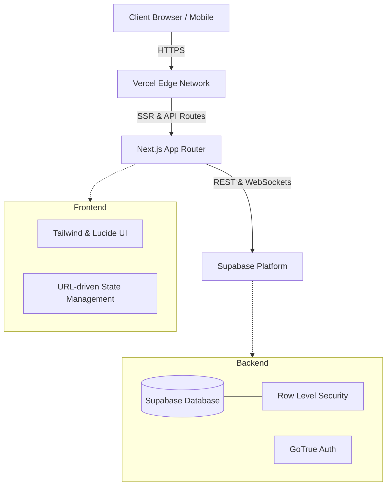
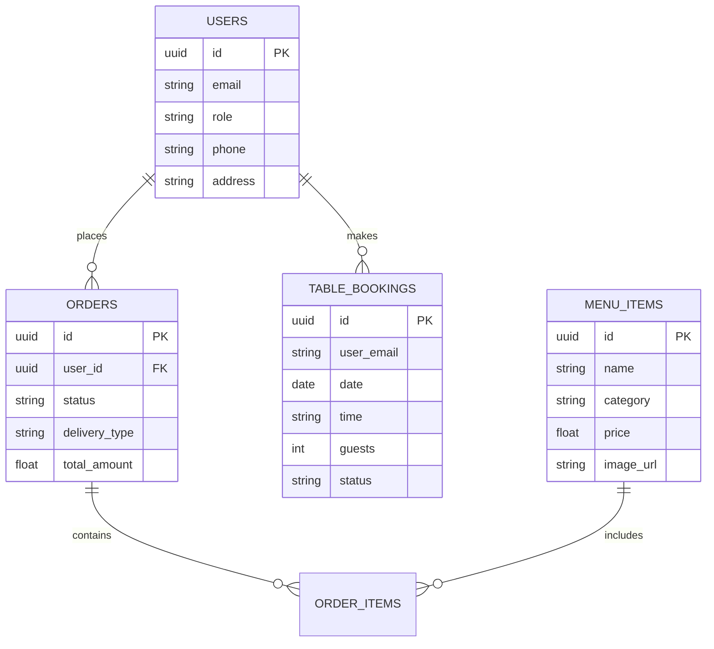

# Premium Restaurant Portal: The Vision & Architecture
**Author:** Subhash
**Date:** October 2026

**Project Links:**
- **Live Portal:** [https://restaurant-portal-ndva.vercel.app/](https://restaurant-portal-ndva.vercel.app/)
- **GitHub Repository:** [https://github.com/SubhashMe/RestaurantPortal](https://github.com/SubhashMe/RestaurantPortal)

## 1. My Vision & Introduction

When I set out to build this Restaurant Portal, my goal was never to just create another food ordering app. I wanted to craft an immersive, premium digital experience that reflects the same level of luxury, precision, and care that we put into our food and service. 

I envisioned a platform where the digital ambiance matches our physical restaurant. From the moment a user logs in, they are greeted by a carefully curated **Midnight & Gold** aesthetic—a design language that speaks of elegance, exclusivity, and warmth. Every interaction, from browsing the menu to booking a table, is designed to be seamless, intuitive, and visually stunning.

This documentation outlines the architecture, core features, and the design philosophy that makes this portal exceptional.

---

## 2. Design Philosophy: The "Midnight & Gold" Aesthetic

Our brand identity is deeply rooted in luxury. The UI is built entirely around a custom "Midnight & Gold" theme:
- **Deep Midnight Backgrounds (`#0f1115`, `#1a1d24`):** These dark, rich tones reduce eye strain while creating a premium, cinematic backdrop for our food imagery.
- **Luminous Gold Accents (`#d4af37`, `amber-500`):** Used strategically for call-to-actions, active states, and iconography to draw the user's eye and add a touch of prestige.
- **Glassmorphism & Micro-interactions:** Subtle blurs, frosted glass panels, and smooth hover animations make the interface feel alive and responsive, without being overwhelming.

---

## 3. Core Features & Capabilities

### 3.1. Dual-Experience Dashboard (Customer & Admin)
The portal intelligently adapts to the user's role:
- **For Guests:** A personalized hub to explore our artisanal menu, manage their cart, track active orders, and handle table reservations.
- **For Admins:** A powerful, bird's-eye command center. The Admin Dashboard features real-time revenue metrics, menu management, and a comprehensive **"Recent Orders"** system that instantly displays Customer Details (Name, Phone) alongside Delivery Details (Table Number or Home Address), ensuring our staff can distinguish and fulfill orders flawlessly.

### 3.2. Intelligent State Persistence
A common frustration in web apps is losing your place when the page refreshes. I engineered the portal to map the active state directly to the URL (`?menu=Dashboard`, `?menu=Categories`). If a user accidentally refreshes their browser, they instantly return exactly where they left off—whether they were browsing desserts, checking their profile, or seeking help and support.

### 3.3. Table Reservations & Strict Policies
To maintain operational excellence, our reservation system is bound by strict business logic:
- **Time Constraints:** Bookings are exclusively accepted between **10:00 AM and 11:00 PM**.
- **Data Integrity:** Every table reservation is strictly mapped to the user's authenticated email, ensuring accountability and a personalized greeting upon arrival.

### 3.4. Dynamic Live Announcements
Communication is key. The "Our Services" section features a dynamic **"Please Read Before Booking"** announcement board. This system automatically pulls the latest updates from the server without requiring a page reload when navigating, ensuring our guests are always informed about special events, dress codes, or exclusive offers.

### 3.5. Robust Security & Deployment
- **Authentication:** Secure user sessions and role-based access control.
- **Row Level Security (RLS):** Our Supabase database is locked down with precise RLS policies, ensuring users only access their own data, while admins have global visibility.
- **Edge Deployment:** Hosted on Vercel, the application is pre-rendered for lightning-fast load times and global scalability.

---

## 4. Architectural Design & Flow

To ensure scalability and real-time responsiveness, the portal follows a modern decoupled architecture.

### 4.1 System Architecture Diagram

### 4.2 Database Entity Relationship

---

## 5. Technology Stack

To achieve this premium feel with uncompromising performance, I selected a modern, robust technology stack:
- **Frontend Framework:** Next.js (React) with App Router for SSR and seamless client-side navigation.
- **Styling:** Tailwind CSS for pixel-perfect, responsive design execution of our Midnight & Gold theme.
- **Icons & Typography:** Lucide React for crisp, elegant iconography.
- **Backend & Database:** Supabase providing real-time database capabilities, seamless APIs, and secure authentication.
- **Version Control & Hosting:** Git, GitHub, and Vercel.

---

## 5. Conclusion

This Restaurant Portal is more than a piece of software; it is the digital extension of our hospitality. By combining state-of-the-art web technologies with a relentless focus on aesthetics and user experience, we have created a platform that not only meets operational demands but exceeds customer expectations at every touchpoint.

*Bon Appétit.*
